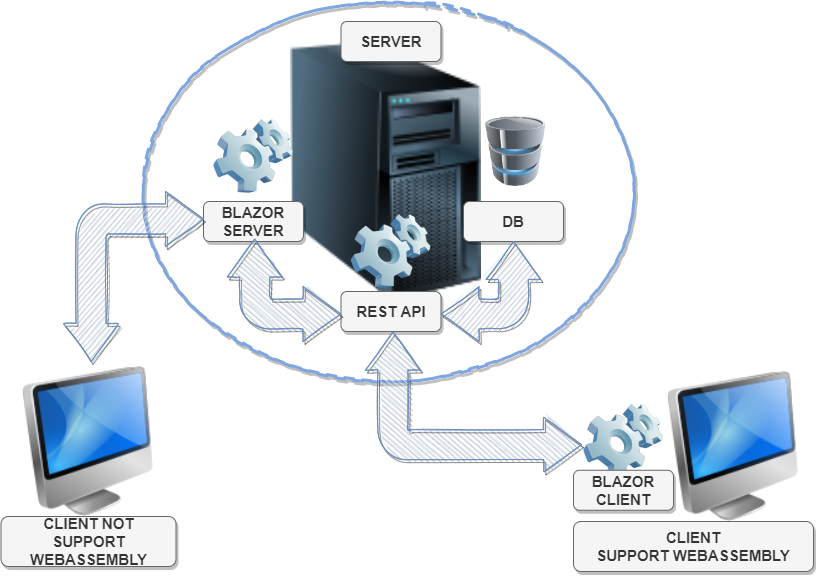

# Інтернет магазин

## Опис
Сучасний інтернет магазин з використанням сучасних стандартів побудови кросплатформенного підходу.
- для безпосередньої робти з даними використовується RESTful API interface
- для браузерів, які не підтрмують WebAssembly створено Blazor Server
- для браузерів, які підтримують WebAssembly клієнт на Blazor Pages
- для підтримки роботи із популярною в Україні CMR 1C підтримка роботи з стандартом ecommerce

## Технології

**IDE**
- Visual Studio 2019
- Visual Studio 2022
- Visual Code

**Мова програмування**
- C# 9
- HTML
- CSS

**Фреймворки**
- .NET 5.O
- ASP.NET Core 5.0

**Технології**
- ASP.NET Core Web API
- Blazor
- Blazor Pages
- RESTfull API

## Resources

- [RESTful API Exemples](https://code-maze.com/net-core-series/)
- [Syncfusion developing](https://www.syncfusion.com/)
- [Best pracice for using parameters in RESTful API](https://www.moesif.com/blog/technical/api-design/REST-API-Design-Filtering-Sorting-and-Pagination/)
- [RESTfull API](https://www.vinaysahni.com/best-practices-for-a-pragmatic-restful-api)
- [RESTfull API Core Concepts](https://developer.channeladvisor.com/rest-api-core-concepts/getting-and-filtering-data)
- [RESTfull API Repository patern](https://code-maze.com/net-core-web-development-part4/#repository)
- [Pragim Technologi Chanal](https://www.pragimtech.com/blog/blazor-webAssembly/progressive-web-apps/)
- [Metanit](https://metanit.com/sharp/tutorial/15.1.php)
- [Microsoft Doc Scafolding](https://docs.microsoft.com/en-us/aspnet/core/security/authentication/scaffold-identity?view=aspnetcore-6.0&tabs=visual-studio)
- [Date Time format](https://www.w3.org/TR/xmlschema11-2/#rf-lexicalMappings-datetime)
- [Statuc Codes, Heders, MIME Types](https://code-maze.com/the-http-reference/)
- [Sorting](https://khalidabuhakmeh.com/sort-data-with-aspnet-core-and-query-strings)
- [Filtering](https://docs.oneall.com/api/basic/filters/)

## REST API
### Naming convention

### Subresource ###

**Macet**
*protocol://host:prot/api/version/resources/identifier*
*protocol://host:port/api/version/resources?
select=property1,property2...
filter=property operation value or/and property operation value
orderby=property desc/aes
count = true
access-token=

*protocol://host:port/api/version/resources/identifier/subresources/identifier*

*hppt://localhost:5000/api/v1/orders/1/items.json*

**protocol:**
- http (Hiper Text Transfer Protocol)
- https (Hiper Text Transfer Protocol Securied)

**host** (name of host server)

**port** (listening port for host server)

**api** - optional name to define that this is api uri

**version** - api version (not decimal)

**resources** - base resource name

**identifire** - id of resource

**subresources** - resources in base resource

**format** - the format of reciving data
- json
- csv
- xml

#### Resources

**Create** 
 * POST .../resources (create resource and return a resource representation)
 
**Read**
 * GET .../resources.format (return the list of all resources)
 * GET .../resources/identifier.format (return a single resource)
 * GET .../resources.format?filter1=value-filter1&filter2=value-filter2 (return list of resources filtered by name and sortet desc)

**Update**
 * PUT .../resources/identifier (updates the entire resource and return a resource representation)
 * PATCH .../resources/identifier (updates only subset of the resource and return a resource representation)
 
**Delete**
 * DELETE .../resources (delete all resources)
 * DELETE .../resources/identifier (delete single resource with identifier)

### Subresources 

**Create**
 * POST .../resources/identifier/subresources (create resource and return a resource representation)

**Read**
 * GET .../resources/identifier/subresources.format

**Update**
 * PUT .../resources/identifier/subresources/identifier (update single subresource with id and return a resource representation)
 * PATCH .../resources/identifier/subresources/identifier (updates only subset of the the protpriesd of singlr subresource and return a resource representation)
 
**Delete**
 * DELETE .../resources/identifier/subresources (delete all subresources in single resource)
 * DELETE .../resources/identifier/subresources/identifier (delete subresource in singler resource)

Getting and Filtering Data
==========================

The ChannelAdvisor REST API supports the [OData
4.0](http://www.odata.org/documentation/) specification, which is an
[OASIS](https://www.oasis-open.org/news/pr/oasis-approves-odata-4-0-standards-for-an-open-programmable-web)
standard that supports filtering, sorting, paging, selecting and
expanding. The select and expand capabilities allow developers to
specify the exact details they want to retrieve as parameters in the
request. This both reduces load on ChannelAdvisor servers and decreases
JSON payload sizes for more efficient network usage. Use of these
features improves performance for downstream systems and ultimately
leads to higher customer satisfaction.  

Filtering {#GettingandFilteringData-Filtering}
=========

Requests can be filtered by using the **\$filter** keyword.  Filters
utilizing a text string value require single quotes around the value,
otherwise no single quotes are required.

The following logical operations are supported:

filters=[field]:[operator]:[value];filters=[field]:[operator]:[value]

?filters=is_closed:eq:false;title:ct:hello+world

| Operator            | Short form | Symbol | Description                                                            |
|---------------------|------------|--------|------------------------------------------------------------------------|
| AndAlso             | and        | &&     | Logical and.                                                           |
| OrElse              | or         | \|\|   | Logical or.                                                            |
| Not                 | not        | !      | Logical not.                                                           |
| Equal               | eq         | ==     | Returns entries where the field is equal to the value.                 |
| NotEqual            | neq        | !=     | Returns entries where the field is not equal to the value.             |
| LessThan            | lt         | <      | Returns entries where the field is lower than the value.               |
| LessThanOrEqual     | lte        | <=     | Returns entries where the field is lower than or equal to the value.   |
| GreaterThan         | gt         | >      | Returns entries where the field is greater than the value.             |
| GreaterThanOrEqual  | gte        | >=     | Returns entries where the field is greater than or equal to the value. |
| Contains            | ct         | ct     | Returns entries where the field contains the value.                    |
| NotContains         | nct        | nct    | Returns entries where the field does not contain the value.            |
| EndsWith            | ev         | ev     | Returns entries where the field ends with the value.                   |
| NotEndsWith         | ne         | ne     | Returns entries where the field does not end with the value.           |
| StartsWith          | bw         | bw     | Returns entries where the field begins with the value.                 |
| NotStartsWith       | nbw        | nbw    | Returns entries where the field does not begin with the value.         |

Additionally, there are several functions that can be used to help
filter specific data types.

| Function | Description                                                                                    | Data Type | Example                 |
|----------|------------------------------------------------------------------------------------------------|-----------|-------------------------|
| Year     | Returns the year component (without the fractional part) of a DateTimeOffset                   | Integer   | year(BirthDate) eq 1971 |
| Month    | Returns the month component (without the fractional part) of a DateTimeOffset                  | Integer   | month(BirthDate) eq 5   |
| Day      | Returns the day component (without the fractional part) of a DateTimeOffset                    | Integer   | day(BirthDate) eq 8     |
| Hour     | Returns the hour component (without the fractional part) of a DateTimeOffset                   | Integer   | hour(BirthDate) eq 4    |
| Minute   | Returns the minute component (without the fractional part) of a DateTimeOffset                 | Integer   | minute(BirthDate) eq 40 |
| Second   | Returns the second component (without the fractional part) of a DateTimeOffset                 | Integer   | second(BirthDate) eq 40 |
| Floor    | Rounds the input numeric parameter down to the nearest numeric value with no decimal component | Decimal   | floor(Freight) eq 32    |
| Ceiling  | Rounds the input numeric parameter up to the nearest numeric value with no decimal component   | Decimal   | ceiling(Freight) eq 32  |

Pagination
=========

"pagination": {
  "current_page": 1,
  "total_pages": 127,
  "entries_per_page": 500,
  "total_entries": 63512,
  "order": {
    "field": "date_creation",
    "direction": "asc"
  }   
}

Notes

- String functions such as 'SubstringOf' and 'StartsWith' are currently not supported.
- When using any of the filters to reference a specific date, but no specific time in a filter, the API assumes the time is 12:00.00am UTC.
- When sending a request to retrieve Orders with \$filter=CreatedDateUtc **eq** 2015-11-15, the only result would be an order created 2015-11-15 at 12:00.00am UTC.
- See some examples below in the "Filtering on properties" for filtering between date ranges or after a specific time.
- To capture all of an item with an Order filter created up to the moment the request is made, try \$filter=CreatedDateUtc **ge**2015-11-15****(assumes today is November 15, 2015)
- Case-Sensitivity in URIs:
- Every property definition before the "?" in a URI is case-sensitive (e.g. attribute name string values)
- Everything after the "?" in a URI is not case-sensitive (e.g. \$filter=property definitions, operators; \$select, \$orderby, etc)

Selecting Properties {#GettingandFilteringData-SelectingProperties}
====================

**Query**

**Example**

Selecting a subset of properties

| Query                                                                                                         | Example                                                                                                                                                                                                                                                                                                                                                                                                                                                                       |
|---------------------------------------------------------------------------------------------------------------|-------------------------------------------------------------------------------------------------------------------------------------------------------------------------------------------------------------------------------------------------------------------------------------------------------------------------------------------------------------------------------------------------------------------------------------------------------------------------------|
| Selecting a subset of properties                                                                              | https://api.channeladvisor.com/v1/Orders?$select=ID, ShippingStatus, CreatedOnDateUtc                                                                                                                                                                                                                                                                                                                                                                                         |
| Filtering on properties                                                                                       | https://api.channeladvisor.com/v1/Orders?$filter=BuyerEmailAddress eq 'first.last@example.com'  https://api.channeladvisor.com/v1/Orders?$filter=CreatedDateUtc ge 2016-03-02  https://api.channeladvisor.com/v1/Orders?$filter=PaymentStatus eq 'Cleared' https://api.channeladvisor.com/v1/Orders?$filter=CreatedDateUtc ge 2016-03-02 and CreatedDateUtc lt 2016-03-03 https://api.channeladvisor.com/v1/Orders?$filter=CreatedDateUtc gt 2016-03-02T14:59:59Z |
| Sorting by a property                                                                                         | https://api.channeladvisor.com/v1/Orders?$orderby=CreatedOnDateUtc desc                                                                                                                                                                                                                                                                                                                                                                                                       |
| Returning the total count of an endpoint                                                                      | https://api.channeladvisor.com/v1/Orders/$count                                                                                                                                                                                                                                                                                                                                                                                                                               |
| Returning the total count of a filtered endpoint                                                              | https://api.channeladvisor.com/v1/Orders?$filter=ProfileID eq 12345678 and CreatedDateUtc gt 2016-05-01&$count=true                                                                                                                                                                                                                                                                                                                                                           |
| Paging through results                                                                                        | Page 1: https://api.channeladvisor.com/v1/Orders  Page 2: https://api.channeladvisor.com/v1/Orders?$skip=20  Page 3: https://api.channeladvisor.com/v1/Orders?$skip=40 See additional notes below about Paging Through Results.                                                                                                                                                                                                                                      |
| Expanding child collections                                                                                   | https://api.channeladvisor.com/v1/Orders?$expand=Items                                                                                                                                                                                                                                                                                                                                                                                                                        |
| Expanding multiple child collections                                                                          | https://api.channeladvisor.com/v1/Orders?$expand=Items,Fulfillments                                                                                                                                                                                                                                                                                                                                                                                                           |
| Expanding 2nd level child collections                                                                         | https://api.channeladvisor.com/v1/Orders?$expand=Fulfillments($expand=Items)                                                                                                                                                                                                                                                                                                                                                                                               |
| Expanding 2nd level child collections for multiple child collections                                          | https://api.channeladvisor.com/v1/Orders?$expand=Items($expand=Adjustments),Fulfillments($expand=Items)                                                                                                                                                                                                                                                                                                                                                                       |
| Selecting properties on child collections                                                                     | https://api.channeladvisor.com/v1/Orders?$expand=Items($select=Sku, Quantity)                                                                                                                                                                                                                                                                                                                                                                                                 |
| Filtering based on child collection property value                                                            | https://api.channeladvisor.com/v1/Orders?$filter=Adjustments/Any(c: c/Reason eq '2')                                                                                                                                                                                                                                                                                                                                                                                          |
| Filtering based on multiple property values (one at endpoint level and one at child collection level)         | https://api.channeladvisor.com/v1/Products?$filter=Attributes/Any (c: c/Value eq '13M') and Brand eq 'Skechers' and Attributes/Any (c: c/Name eq 'Size') &$expand=Attributes                                                                                                                                                                                                                                                                                                  |
| Retrieve the first 50 products with ID and Sku only                                                           | https://api.channeladvisor.com/v1/Products?$select=ID,Sku&$top=50                                                                                                                                                                                                                                                                                                                                                                                                             |
| Retreive the second 50 products with ID and Sku only Note: $skip must appear before $top for this to work  | https://api.channeladvisor.com/v1/Products?$select=ID,Sku&$skip=50&$top=50                                                                                                                                                                                                                                                                                                                                                                                                    |

DateTimeOffset {#GettingandFilteringData-DateTimeOffset}
==============

Read about "Lexical Mapping" on [this W3
page](https://www.w3.org/TR/xmlschema11-2/#rf-lexicalMappings-datetime)
for more information on formatting DateTimeOffset.

**Proper Format:**

Any of the below formats are accurate within the API and will be
interpreted correctly within POST/PATCH/PUT requests. \
GET requests will allow the below, but do not require the time to
execute properly.

-   2016-10-31T14:08:36.8033257Z
-   2016-08-19T10:44:15Z
-   2016-10-31T14:08:36.8033257-04:00
-   2016-10-31T14:08:36.8033257+12:00
-   2016-08-19T10:44:15+01:00

Paging Through Results {#GettingandFilteringData-PagingThroughResults}
======================

Each page of results will have a link to the next page embedded in the
**@odata.nextLink** property. The last page will not contain a value for
**@odata.nextLink**, indicating the end of the result set.

It is highly recommended to use the **@odata.NextLink** URI for paging
instead of manually setting a **\$skip** value because maximum page
sizes may vary.

For most GET requests, the default response page size is 20, but some
endpoints, such as Products, support larger page sizes in order to
optimize performance and efficiency.

**HTTP Statuses**

Since REST APIs depend upon HTTP standards, each request’s status is used to communicate the result of the request, such as success or failure. Each status code provides a machine-readable response, plus a human-readable message. Web developers (and a number of users) will be familiar with many of these.

- 200: Success
- 201: Created
- 404: Not found
- 401: Unauthorized
- 403: Forbidden
- 429: Too many requests

- 200 OK - Response to a successful GET, PUT, PATCH or DELETE. Can also be used for a POST that doesn't result in a creation.
- 201 Created - Response to a POST that results in a creation. Should be combined with a Location header pointing to the location of the new resource
- 204 No Content - Response to a successful request that won't be returning a body (like a DELETE request)
- 304 Not Modified - Used when HTTP caching headers are in play
- 400 Bad Request - The request is malformed, such as if the body does not parse
- 401 Unauthorized - When no or invalid authentication details are provided. Also useful to trigger an auth popup if the API is used from a browser
- 403 Forbidden - When authentication succeeded but authenticated user doesn't have access to the resource
- 404 Not Found - When a non-existent resource is requested
- 405 Method Not Allowed - When an HTTP method is being requested that isn't allowed for the authenticated user
- 410 Gone - Indicates that the resource at this end point is no longer available. Useful as a blanket response for old API versions
- 415 Unsupported Media Type - If incorrect content type was provided as part of the request
- 422 Unprocessable Entity - Used for validation errors
- 429 Too Many Requests - When a request is rejected due to rate limiting

#User Read#
Where User name = jkjj
Where User id = 453535
Where User name begin from asc sort by name acs
Where User age >= 18 sort by age dec
where user age>=10 and name like "vas" sort by date regis firs 40 